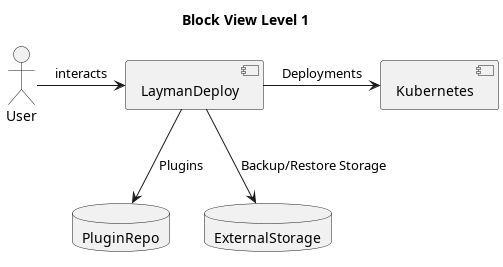

# LaymanDeploy

**About arc42**

arc42, the template for documentation of software and system
architecture.

Template Version 8.2 EN. (based upon AsciiDoc version), January 2023

Created, maintained and © by Dr. Peter Hruschka, Dr. Gernot Starke and
contributors. See <https://arc42.org>.

# Introduction and Goals

LaymanDeploy is intended to be a easy to use, yet powerful tool to setup a Kubernetes Cluster and orchestrate Services on it. It is intended to be used by people with little to no technical knowledge, but also by experienced users, that want to save time and effort, so it tries to abstract as much technical details as possible, while still providing the ability to customize the orchestration.

## Requirements Overview

- Provide a easy to use Interface, that abstracts all technical details that can be omitted.
- Pre-validate the orchestration through config file linting.
- Provide backup and restore capability per Service and Cluster.
- Monitor Service and Cluster health.
[Bachelor Expose with requirements](https://github.com/jdmmnn/BachelorExpose/blob/f7c4bf11c4d55d2474e41e1c8773851d4ce42cfd/template/termpaper.pdf) (in german)

## Quality Goals

- The tool should be easy to use, so that even people with little to no technical knowledge can use it.
- The orchestration should be validated before deployment, so that errors can be detected early.
- The Services and Clusters can be backed up and restored, so that data loss can be prevented.
- The Services and Clusters can be monitored, so that errors can be detected early and restarted automatically.
- The tool should be platform agnostic, so that it can be used on any platform that supports Kubernetes.
- It should provide a setup for the hardware, so that it can be assured, that the data is not accessible by unauthorized people.
- It should provide a setup for the Kubernetes cluster, so that the cluster is configured correctly for the Services.

## Stakeholders

| Role/Name       | Contact         | Expectations                                |
| --------------- | --------------- | ------------------------------------------- |
| *User*          | *\<Contact-1>*  | *Easy to use*                               |
|                 |                 | *Transparent usage with minimal user input* |
|                 |                 | *No deep technical knowledge required*      |
|                 |                 | *User Stories with bundled Services*        |
| *Administrator* | *\<Contact-2>*  | *Fast to setup*                             |
|                 |                 | *Remote monitoring*                         |
|                 |                 | *Remote deployment*                         |
|                 |                 | *Easy backup and restore*                   |
|                 |                 | *Load ready to go configuration*            |
| *Developer*     | *Jesko Dammann* | *Learning experience*                       |
|                 |                 | *working MVP*                               |

# Architecture Constraints

- Light weight
- Platform agnostic
- Kubernetes

# System Scope and Context

## Business Context

## Technical Context

### LaymanSetup

**Mapping Input/Output to Channels**

1. **User -> SetupService (Channel: Graphical User Interface)** 
    - **Input**: User puts in necessary data for the deployment.
    - **Output**: Responses and data from the graphical user interface shown to the user.

2. **SetupService -> Ansible (Channel: Filesystem)**
    - **Input**: Configure the predefined playbook with inputs from the user.
    - **Output**: Validation response from Ansible.
  
3. **Ansible -> Server (Channel: SSH)**
    - **Input**: Execute the playbook on the server.
    - **Output**: Responses from the server, indicating success or failure of the operations.

4. **Ansible -> Kubernetes (Channel: kubeadm)**
    - **Input**: Deploy the LaymanDeploy Service to the Kubernetes Cluster.
    - **Output**: Responses from the Kubernetes Cluster, indicating success or failure of the operations.

### LaymanDeploy

**Mapping Input/Output to Channels**

1. **User -> Web Interface (Channel: HTTP over Network)** 
    - **Input**: User commands or requests from the web interface.
    - **Output**: Responses and data from the web interface shown to the user.

2. **Web Interface -> Backend Service (Channel: Rest over Network)**
    - **Input**: Requests from the web interface to fetch data, start/stop services, etc.
    - **Output**: Responses from the backend service, indicating success or failure of the operations.

3. **Backend Service -> Services on Kubernetes (Channel: Kubernetes API Calls)**
    - **Input**: Requests from the Services to read service state, fetch configuration data, etc.
    - **Output**: Required data for backup/restore operations from the services running on Kubernetes.

4. **Backend Service -> External Storage (Channel: Storage API Calls)**
    - **Input**: Requests from the backup/restore service to write backup data, read restore data, etc.
    - **Output**: Responses from the external storage, indicating success or failure of the storage operations.

5. **Backend Service -> Services on Kubernetes (Channel: Kubernetes API Calls)**
    - **Input**: Requests from the Kubernetes Cluster to fetch service logs, monitor network traffic, etc.
    - **Output**: Service logs, network traffic data, and other monitoring-related data from the services running on Kubernetes.

6. **Backend Service -> Git Repository (Channel: Git Operations over Network)**
    - **Input**: Fetch requests from the backend service to fetch plugin definitions from the Git repository.
    - **Output**: Plugin definitions from the Git repository.

7. **Backend Service -> Kubernetes (Channel: Kubernetes API Calls)**
    - **Input**: Requests from the Backend service to create new deployments, update existing ones, or remove services.
    - **Output**: Responses from Kubernetes, indicating success or failure of the deployment operations.

8.  **Services -> Kubernetes (Channel: Kubernetes API Calls)**
    - **Input**: Interactions of the services with the Kubernetes API, running as a pod, etc.
    - **Output**: Responses from Kubernetes, indicating the results of the operations.

# Solution Strategy

## Goals

- Lightweight to run on edge devices
- Easy to use
- Stable and reliable
- Extensible
- Platform agnostic

## Key Challenges

- Validation of Plugin compatibility/orchestration
- Validation of User Input
- Minimizing Service redundancy

## Architectural Principals

- **KISS** (Keep it simple, stupid)
- **DRY** (Don't repeat yourself)
- Monolithic architecture

# Building Block View

## Level One

## Level Two

## Level Three

## Whitebox Overall System

***\<Overview Diagram>***

Motivation  
*\<text explanation>*

Contained Building Blocks  
*\<Description of contained building block (black boxes)>*

Important Interfaces  
*\<Description of important interfaces>*

### \<Name black box 1>

*\<Purpose/Responsibility>*

*\<Interface(s)>*

*\<(Optional) Quality/Performance Characteristics>*

*\<(Optional) Directory/File Location>*

*\<(Optional) Fulfilled Requirements>*

*\<(optional) Open Issues/Problems/Risks>*

### \<Name black box 2>

*\<black box template>*

### \<Name black box n>

*\<black box template>*

### \<Name interface 1>

…

### \<Name interface m>

## Level 2

### White Box *\<building block 1>*

*\<white box template>*

### White Box *\<building block 2>*

*\<white box template>*

### White Box *\<building block m>*

*\<white box template>*

## Level 3

### White Box \<\_building block x.1\_\>

*\<white box template>*

### White Box \<\_building block x.2\_\>

*\<white box template>*

### White Box \<\_building block y.1\_\>

*\<white box template>*

# Runtime View

## \<Runtime Scenario 1>

-   *\<insert runtime diagram or textual description of the scenario>*

-   *\<insert description of the notable aspects of the interactions
    between the building block instances depicted in this diagram.>*

## \<Runtime Scenario 2>

## …

## \<Runtime Scenario n>

# Deployment View

## Infrastructure Level 1

***\<Overview Diagram>***

Motivation  
*\<explanation in text form>*

Quality and/or Performance Features  
*\<explanation in text form>*

Mapping of Building Blocks to Infrastructure  
*\<description of the mapping>*

## Infrastructure Level 2

### *\<Infrastructure Element 1>*

*\<diagram + explanation>*

### *\<Infrastructure Element 2>*

*\<diagram + explanation>*

…

### *\<Infrastructure Element n>*

*\<diagram + explanation>*

# Cross-cutting Concepts

## *\<Concept 1>*

*\<explanation>*

## *\<Concept 2>*

*\<explanation>*

…

## *\<Concept n>*

*\<explanation>*

# Architecture Decisions

# Quality Requirements

## Quality Tree

## Quality Scenarios

# Risks and Technical Debts

# Glossary

| Term        | Definition        |
| ----------- | ----------------- |
| *\<Term-1>* | *\<definition-1>* |
| *\<Term-2>* | *\<definition-2>* |
